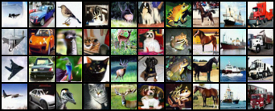

# CIFAR10_DDPM
This notebook is modified from these 2 excellent repo:

[Conditional Diffusion MNIST by Tim Pearce](https://github.com/TeaPearce/Conditional_Diffusion_MNIST)

[Diffusion Model (U-Net) by EBRAHIM ELGAZAR](https://www.kaggle.com/code/ebrahimelgazar/diffusion-model-u-net)

Link to: [Pretrained model](https://drive.google.com/file/d/1LJKESGuHfjtUWlhGcczv5LiCE3CBQie4/view?usp=sharing)

